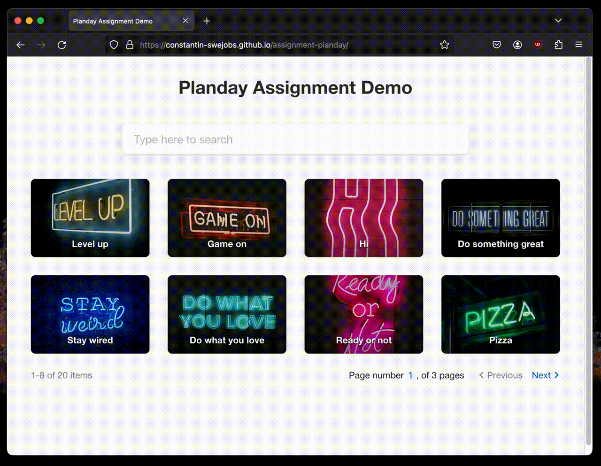

# Planday Assignment Demo

(Constantin Panaitescu)

[**Demo link**](https://constantin-swejobs.github.io/assignment-planday/)

## Installation

In the project directory, run:

`npm install`
or
`yarn`

## Usage

### Building

In the project directory, run

`npm run build`
or
`yarn build`

... which will generate a static bundle in _`public/dist`_. The application can be accessed by statically serving the _`public`_ folder.

### Testing

To execute the testing suite, within the project directory run

`npm run test`
or
`yarn test`

**Areas of interest:**

| Location                                                                                                               | Notes                                                                             |
| ---------------------------------------------------------------------------------------------------------------------- | --------------------------------------------------------------------------------- |
| [**`src/ui/pagination-controls/PaginationControls.test.tsx`**](src/ui/pagination-controls/PaginationControls.test.tsx) | UI component (unit tests example)                                                 |
| [**`src/views/__tests__/DataItemsGridView.test.tsx`**](src/views/__tests__/DataItemsGridView.test.tsx)                 | Integration tests example (interactions between UI components, state rules & API) |

### Formatting

In the project directory, run

`npm run fmt:check`
or
`yarn fmt:check`

... to validate the source against the configured code formatter ([_Prettier_](https://prettier.io/)), and

`npm run fmt:format`
or
`yarn fmt:format`

... to automatically format all files.

## Notes

- All reusable UI fragments that represent basic UI components are placed within [_`src/ui`_](src/ui), and are defined without access to global state/logic. Styles associated with them are placed in [_`src/ui/_styles`_](src/ui/_styles).
- The data models and provided data are placed in [_`src/api`_](src/api), being exposed as a React Context/Provider implementation to decouple the concrete data service implementation from the consumer view, in order to facilitate mocking ease for various scenarios for integration testing purposes.
